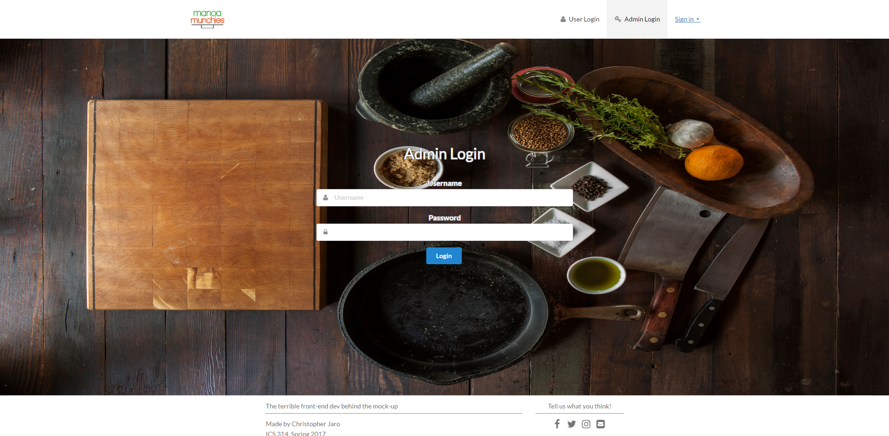
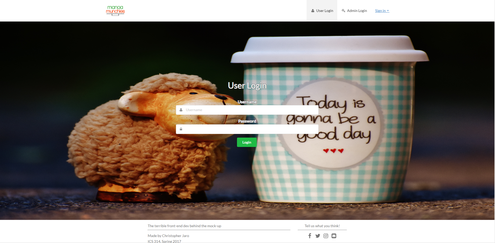
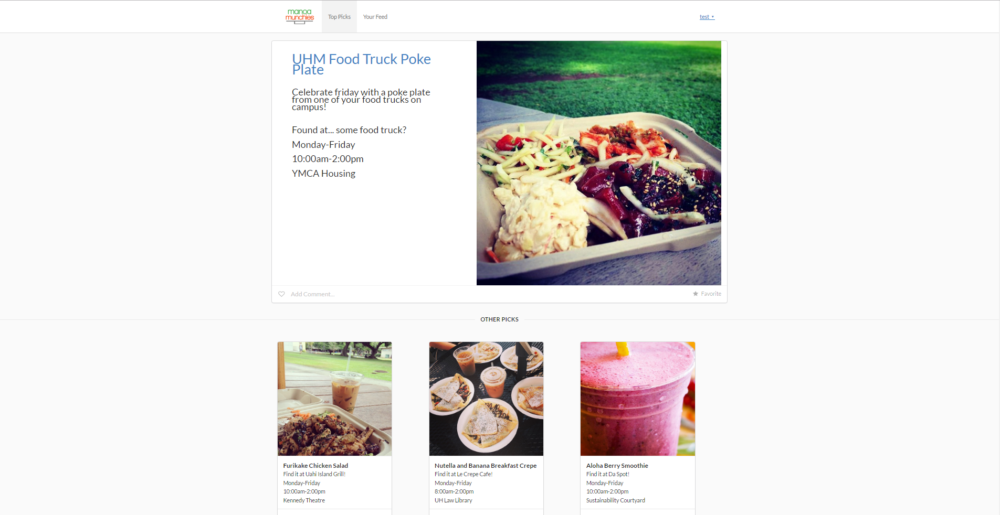

# Current Project -- Manoa Munchies

# Table of contents

* [About Manoa Munchies](#about-manoa-munchies)
* [Installation](#installation)
* [Development history](#development-history)
  * [Milestone 1: Mockup development](#milestone-1-mockup-development)

## About Manoa Munchies
Manoa Munchies is about providing students of UH Manoa a better dining experience at the University of Hawaii at Manoa through providing more digestible information which allows the user to decide what food they want on any given day. In addition to providing a better dining experience for the consumers, food vendors will be able to provide information to potential customers of what food is available on the menu for all days of the week and their hours of operation.

Prospective users that first arrive at the site will appear on the landing page which will inform them about the app.


UH Manoa Login system integration with the application will allow students and/or registered vendors to login.



First time users will be prompted to fill out a form for their general profile information along with key tags or likes/dislikes for food to automatically tailor the user homepage for their own personalized feed. Top picks and/or user feed page may be integrated into a single page.




Future navigation bar will implement a search form and an "Our vendors" option to allow the user to update their feed page reactively based upon the given "tag" that they crave at that time. 

# Installation

Ensure that meteor is run on your system, if not [install Meteor](https://www.meteor.com/install).

Afterwards, clone or [download a copy](https://github.com/tasteofmanoa/manoa-munchies/archive/master.zip)
of the repository to your system.
  
After successfully cloning/downloading the reposity, open command prompt or terminal and enter the following commands in the app directory of the repository. 

```
$ meteor npm install
```
```
$ meteor npm run start
```

If your instal of our application is successful, you should see the app in your browser at [http://localhost:3000](http://localhost:3000).


# Development History

The development process for BowFolios conformed to [Issue Driven Project Management](http://courses.ics.hawaii.edu/ics314s17/modules/project-management/) practices. In a nutshell, development consists of a sequence of Milestones. Milestones consist of issues corresponding to 2-3 day tasks. GitHub projects are used to manage the processing of tasks during a milestone.  

Documentation of the development history of Manoa Munchies are represented in milestones as shown below. 

## Milestone 1: Mockup development [Work in progress]

This milestone started on April 5, 207.


