# Table of contents

* [About Manoa Munchies](#about-manoa-munchies)
* [User Guide](#user-guide)
* [Developer Guide](#developer-guide)
* [Development history](#development-history)
  * [Milestone 1: Mockup development](#milestone-1-mockup-development-wip)
  * [Milestone 2: Collections and Functionality](#milestone-2-collections-and-functionality)
  * [Milestone 3: Collection Revision, Functionality, and Testing ](#milestone-3-collection-revision,-functionality,-and-testing)

# About Manoa Munchies
Manoa Munchies is about providing students of UH Manoa a better dining experience at the University of Hawaii at Manoa through providing more digestible information which allows the user to decide what food they want on any given day. In addition to providing a better dining experience for the consumers, food vendors will be able to provide information to potential customers of what food is available on the menu for all days of the week and their hours of operation.

# User Guide

## Landing Page
User first arrives on the landing page where they are greeted/informed of what the app does and the services it offers.
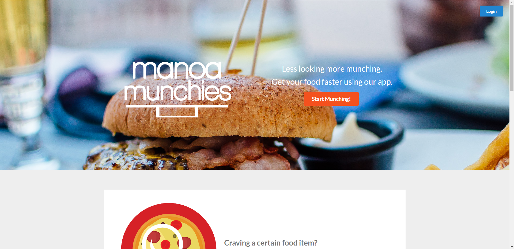

## UH Login
Clicking Login from the Landing page pulls up UH Login popup. Users with UH accounts are able to sign in which routes them to profile.
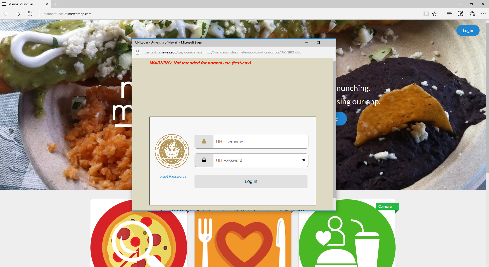

## Profile
The profile page gives information about the user and updates their favorites/preferences on their user homepage based upon their preferred tags. Information given in the profile form page will be shown when other users try to find friends. Profile picture will be updated reactively.
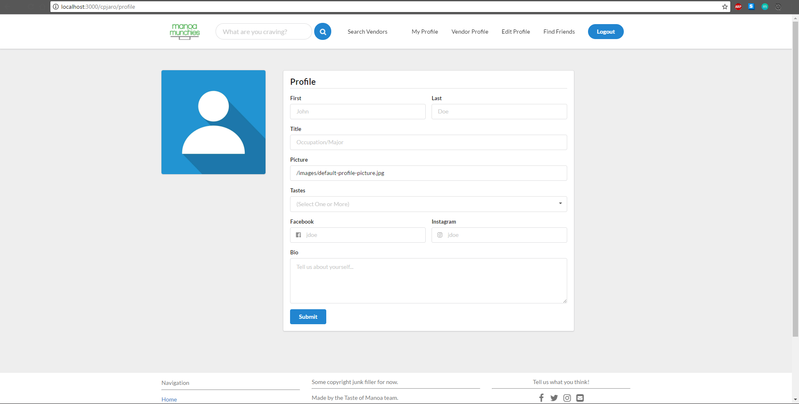
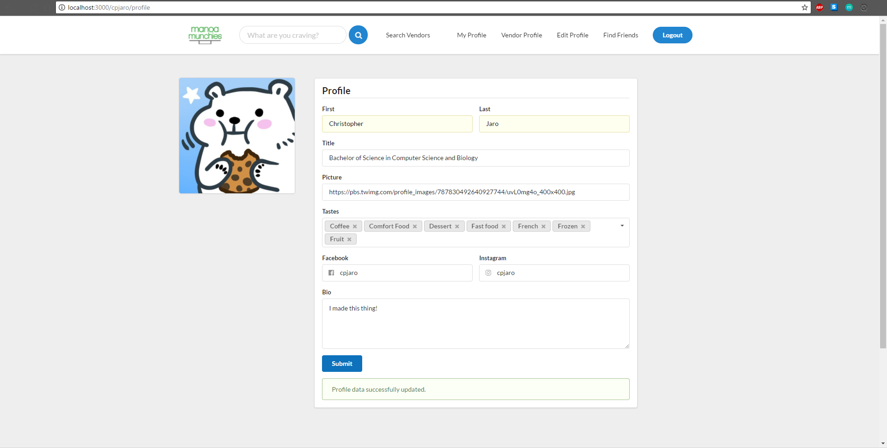

## User Homepage
User homepage allows the user to search for a certain craving that they have. This can be done on any page via the top navigation search bar. The User homepage provides the user of the top picks of the day as well as their favorite food items that are available for that day.
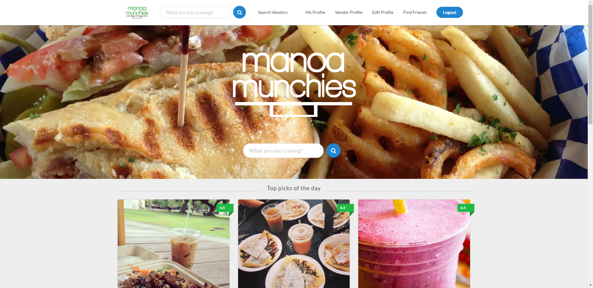
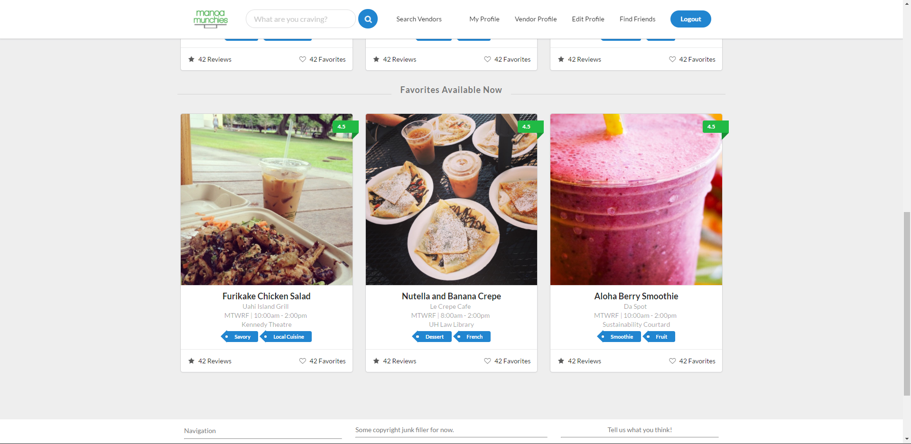

## Find Friends
Users will be able to find their friends and be able to use the friend as a tag to find similar preferred/favorite foods.
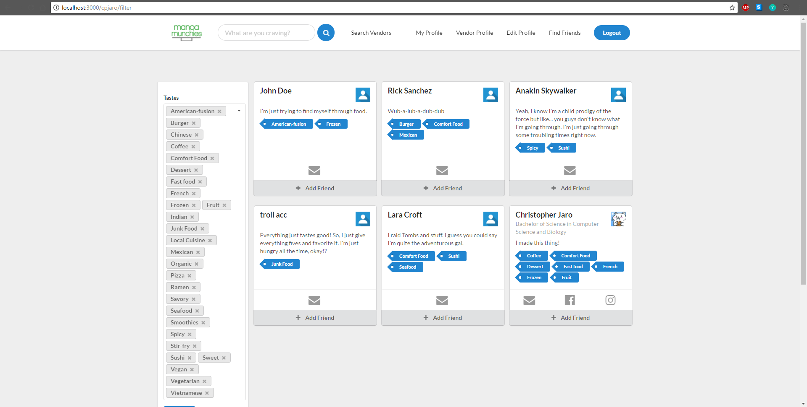

## Search results
Search results will filter through results based on the string inputted by the user, current availability, time frame availability, friend tags, price, and tastes.
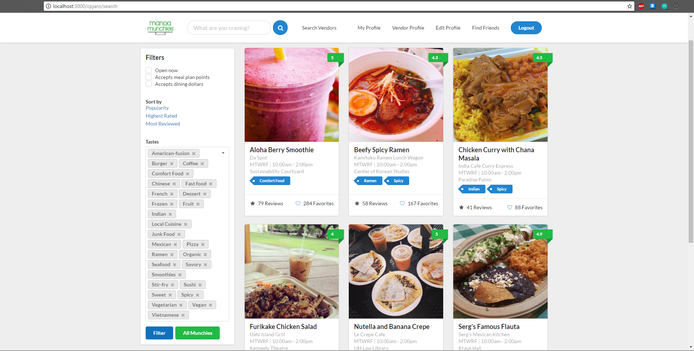


# Developer Guide

Ensure that the latest version meteor and most stable version of node is run on your system, if not [install Meteor](https://www.meteor.com/install).

Afterwards, clone or [download a copy](https://github.com/tasteofmanoa/manoa-munchies/archive/master.zip)
of the repository to your system.

After successfully cloning/downloading the repository, open command prompt or terminal and enter the following commands in the app directory of the repository.

```
$ meteor npm install
```
```
$ meteor npm run start
```

If your install of our application is successful, you should see the app in your browser at [http://localhost:3000](http://localhost:3000).


# Development History

The development process for Manoa Munchies conformed to [Issue Driven Project Management](http://courses.ics.hawaii.edu/ics314s17/modules/project-management/) practices.


Github project and issue pages were used to manage the progression of the projects using by defining "Milestones" and issues associated with each milestone.

General branch management consists of a branch nomenclature of the following: (issue)(issue #)-(first and last initials). This prevents any mix-ups of which branch belongs to who and one can properly evaluate who worked on what branch just by looking at the branch name.

Documentation of the development history of Manoa Munchies are represented in milestones as shown below.

## Milestone 1: Mockup development WIP
The main objective of the mockup is to get a HTML mockup of what the app should look like without the functionality.

This milestone started on April 5, 2017 and completed on April 13, 2017.


Milestone one was managed using both [Manoa Munchies GitHub Issues page](https://github.com/tasteofmanoa/manoa-munchies/milestone/1) and [Manoa Munchies GitHub Projects page](https://github.com/tasteofmanoa/manoa-munchies/projects/1). Issues are sorted in order of how integral each item is to the project and/or creates a good foundation for the next issue. For example, the card element from semantic UI is an integral part in the user's experience in each page and, therefore, cards must have a good format in which information is easily digestible.

Milestone 1 was implemented as [Manoa Munchies GitHub Milestone 1](https://github.com/tasteofmanoa/manoa-munchies/milestone/1)
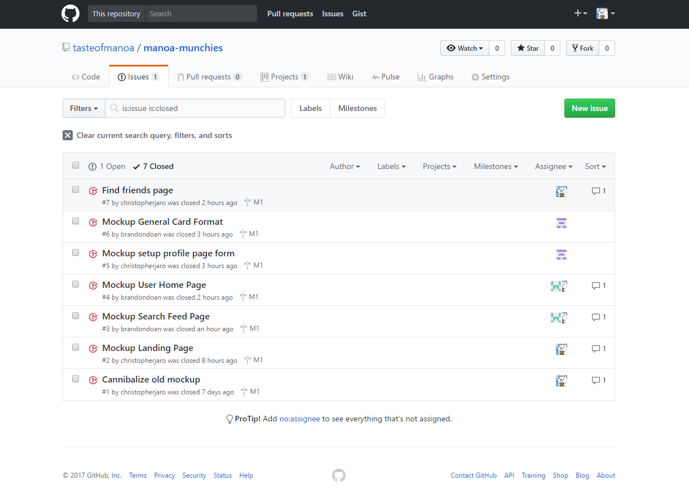

Milestone 1 consisted of seven issues which were all managed in the [Manoa Munchies GitHub Projects page](https://github.com/tasteofmanoa/manoa-munchies/projects/1).
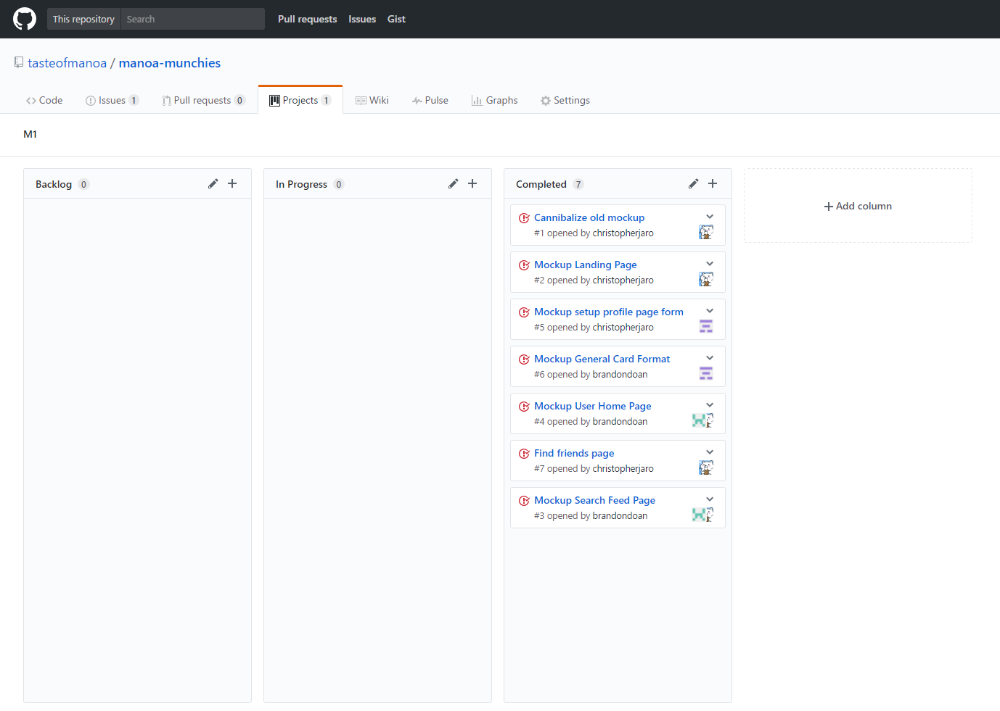

Each member is assigned an issue to make a mockup of. However, all members, ideally, will create their own mockup to provide a greater number of prototypes to play with in order to decide what is optimal for the user experience.

As said previously, branch nomenclature goes by (issue)(issue #)-(first and last initials). This prevents any mix-ups of which branch belongs to who and one can properly evaluate who worked on what branch just by looking at the branch name. Each issue when completed will be pushed to master when it is completed.

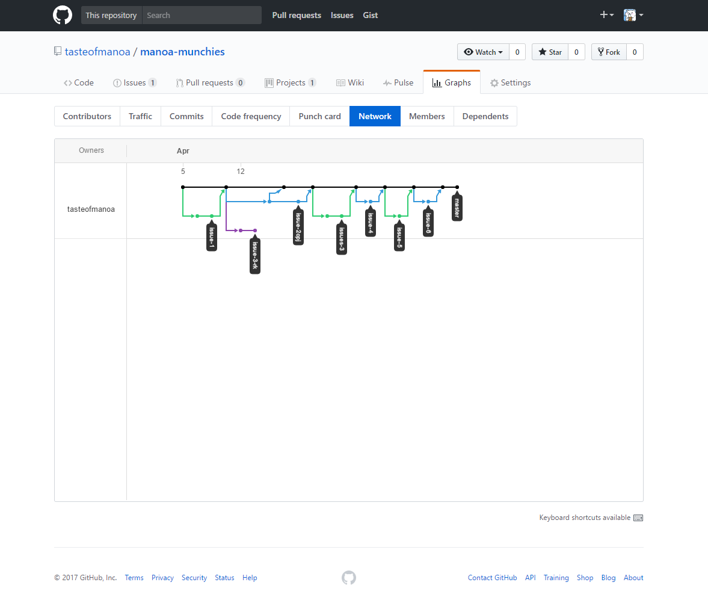

Milestone 1 was deployed to [galaxy](https://tasteofmanoa.meteorapp.com) on April 12, 2017.
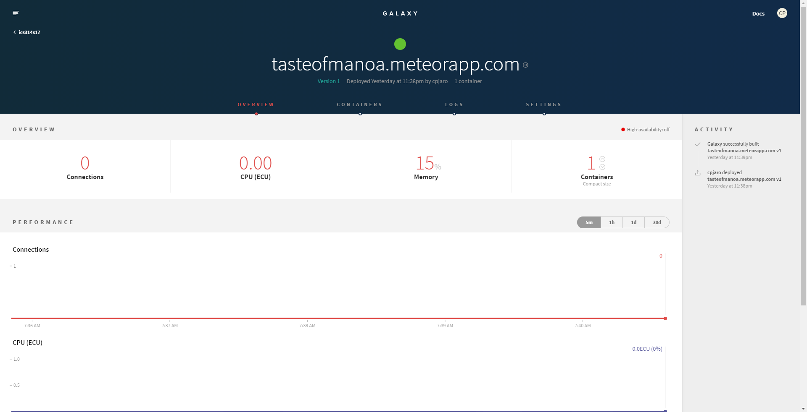

## Milestone 2: Collections and More Functionality
The main objective is to add additional functionality to the application and in order to do that, collections for the database need to be implemented. Major goals for this milestone are to implement the tastes, profile, vendor, and food item collections as well as implement sorting based on the fields within those collections. In addition, producing a script to check for user time once the collections have been implemented will get the app going to near full functionality.

New nomenclature branch system: m2-(issue abbreviated)-(initials of dev working on that branch)

This milestone started on April 13, 2017 and completed on April 27, 2017.
The following pages were made/edited.


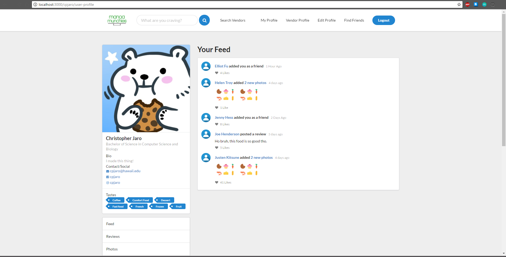


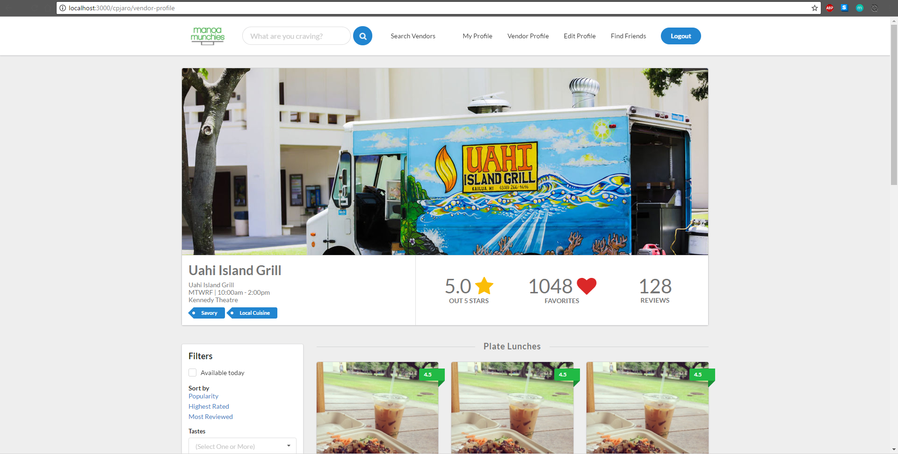


Milestone 2 was implemented as [Manoa Munchies GitHub Milestone 2](https://github.com/tasteofmanoa/manoa-munchies/milestone/2)
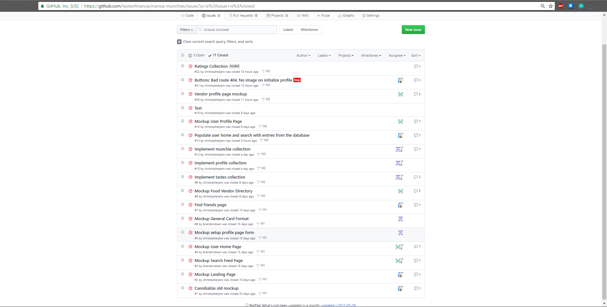

Milestone 2 currently consists of six issues which are all going to be managed in the [Manoa Munchies GitHub Projects page](https://github.com/tasteofmanoa/manoa-munchies/projects/2).
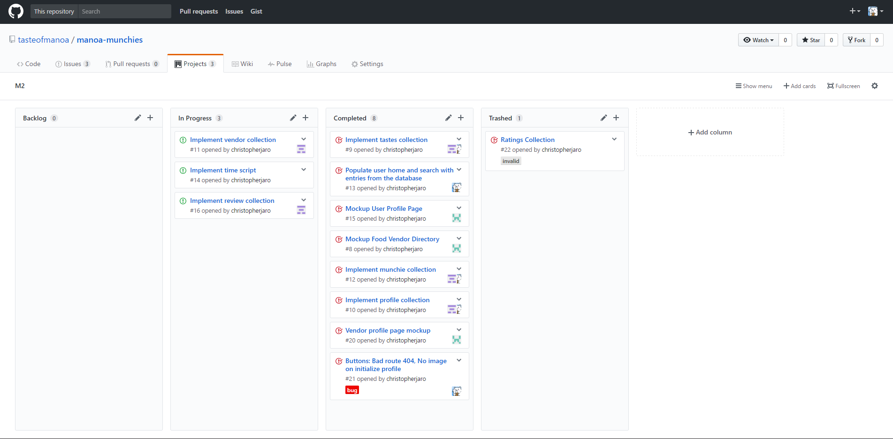

New nomenclature branch system: m2-(issue abbreviated)-(initials of dev working on that branch). Work was done in branches before committing to master, mainly pulled from master to update branches.
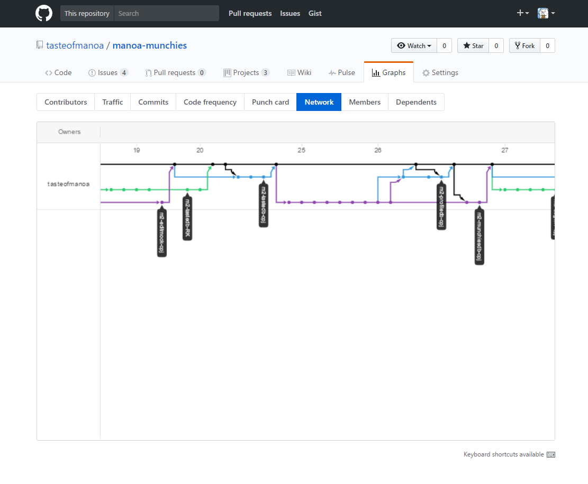

Milestone 2 was deployed to [galaxy](https://tasteofmanoa.meteorapp.com) on April 27, 2017.


## Milestone 3: Collection Revision, Functionality, and Testing
