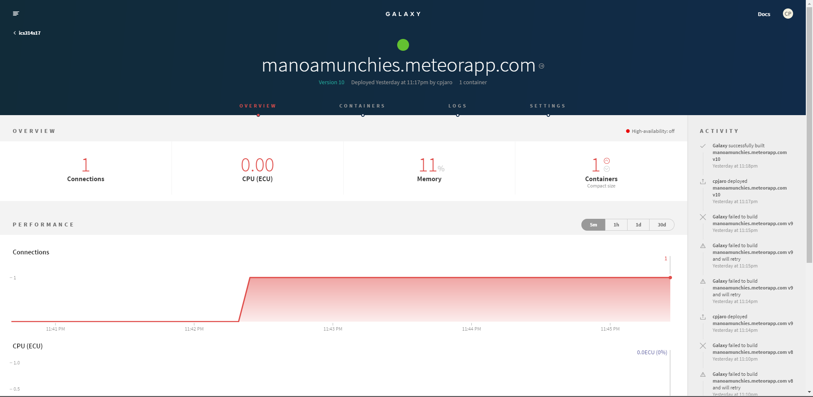

# Table of contents

* [About Manoa Munchies](#about-manoa-munchies)
* [User Guide](#user-guide)
* [Developer Guide](#developer-guide)
* [Initial User Study](#initial-user-study)
* [Development history](#development-history)
  * [Milestone 1: Mockup development](#milestone-1-mockup-development-wip)
  * [Milestone 2: Collections and Functionality](#milestone-2-collections-and-functionality)
  * [Milestone 3: Collection Revision, Functionality, and Testing ](#milestone-3-collection-revision,-functionality,-and-testing)

# About Manoa Munchies
Manoa Munchies is about providing students of UH Manoa a better dining experience at the University of Hawaii at Manoa through providing more digestible information which allows the user to decide what food they want on any given day. In addition to providing a better dining experience for the consumers, food vendors will be able to provide information to potential customers of what food is available on the menu for all days of the week and their hours of operation.

# User Guide

## Landing Page
User first arrives on the landing page where they are greeted/informed of what the app does and the services it offers.


## UH Login
Clicking Login from the Landing page pulls up UH Login popup. Users with UH accounts are able to sign in which routes them to profile.


## Profile
The profile page gives information about the user and updates their favorites/preferences on their user homepage based upon their preferred tags. The first time login will initialize the profile to the database. Information given in the profile form page will be shown when other users try to find friends. Profile picture will be updated reactively.


## User Homepage
User homepage allows the user to search for a certain craving that they have. This can be done on any page via the top navigation search bar. The User homepage provides the user of the top picks of the day as well as their favorite food items that are available for that day.


## Find Friends
Users will be able to find their friends and be able to use the friend as a tag to find similar preferred/favorite foods. Currently can only sort by tastes. Users are not added until they have given they're "tastes."


## Search results
Search results will filter through results of food items based on the string inputted by the user, current availability, time frame availability, friend tags, price, and tastes. Currently can only sort by tastes. Mousing over a card gives the option to favorite the munchie or food item.


## Search for vendors and Look at their page
Search for vendors by taste/acceptance of certain payments and visit their page to see the whole menu. The menu can also be sorted if individuals wish to only see certain food items. However, sorting has not yet been implemented due to vendor collections not working at this present time.


# Developer Guide

Ensure that the latest version meteor and most stable version of node is run on your system, if not [install Meteor](https://www.meteor.com/install).

Afterwards, clone or [download a copy](https://github.com/tasteofmanoa/manoa-munchies/archive/master.zip)
of the repository to your system.

After successfully cloning/downloading the repository, open command prompt or terminal and enter the following commands in the app directory of the repository.

```
$ meteor npm install
```
```
$ meteor npm run start
```

If your install of our application is successful, you should see the app in your browser at [http://localhost:3000](http://localhost:3000).

If any changes are made to any of the sub-directories of app/imports/api, it is required to execute:
```
$ meteor reset
```
As standard with changing any collection.

# Application Design

## Directory structure

The top-level directory structure contains:

```
app/        # holds the Meteor application sources
config/     # holds configuration files, such as settings.development.json
.gitignore  # don't commit IntelliJ project files, node_modules, and settings.production.json
```
The separation of the actual meteor app and the config files, .json, and .ignore allow for better project management and avoid excess clutter. Consolidation of all files in a single directory is not advised for directory readability.

The app/ directory has this top-level structure:

```
client/
  lib/           # holds Semantic UI files.
  head.html      # the <head>
  main.js        # import all the client-side html and js files.

imports/
  api/           # Define collection processing code (client + server side)
    base/
    munchie/     # Collection for food items, used for favorites and vendor menus.
    profile/     # Profiles for users
    taste/       # associated tags with food items/vendors
    vendor/      # Vendors of UH,
  startup/       # Define code to run when system starts up (client-only, server-only)
    client/        
    server/        
  ui/
    components/  # templates of common components/forms that used for web development.
    layouts/     # Layouts contain the templates that act as a base for pages that share
                   common component templates.
    pages/       # Pages are navigated to by FlowRouter routes.
    stylesheets/ # CSS customizations, if any.

node_modules/    # managed by Meteor

private/
  database/      # Holds the required JSON file to initialize the database. If not present,
                   app holds no functionality on build other than profile creation.

public/          
  images/        # holds all the assets for profiles, munchies, vendors, and site graphics.

server/
   main.js       # import all the server-side js files.
```
# Development History

The development process for Manoa Munchies conformed to [Issue Driven Project Management](http://courses.ics.hawaii.edu/ics314s17/modules/project-management/) practices.


Github project and issue pages were used to manage the progression of the projects using by defining "Milestones" and issues associated with each milestone.

General branch management consists of a branch nomenclature of the following: (issue)(issue #)-(first and last initials). This prevents any mix-ups of which branch belongs to who and one can properly evaluate who worked on what branch just by looking at the branch name.

Documentation of the development history of Manoa Munchies are represented in milestones as shown below.

## Milestone 1: Mockup development WIP
The main objective of the mockup is to get a HTML mockup of what the app should look like without the functionality.

This milestone started on April 5, 2017 and completed on April 13, 2017.


Milestone one was managed using both [Manoa Munchies GitHub Issues page](https://github.com/tasteofmanoa/manoa-munchies/milestone/1) and [Manoa Munchies GitHub Projects page](https://github.com/tasteofmanoa/manoa-munchies/projects/1). Issues are sorted in order of how integral each item is to the project and/or creates a good foundation for the next issue. For example, the card element from semantic UI is an integral part in the user's experience in each page and, therefore, cards must have a good format in which information is easily digestible.

Milestone 1 was implemented as [Manoa Munchies GitHub Milestone 1](https://github.com/tasteofmanoa/manoa-munchies/milestone/1)


Milestone 1 consisted of seven issues which were all managed in the [Manoa Munchies GitHub Projects page](https://github.com/tasteofmanoa/manoa-munchies/projects/1).


Each member is assigned an issue to make a mockup of. However, all members, ideally, will create their own mockup to provide a greater number of prototypes to play with in order to decide what is optimal for the user experience.

As said previously, branch nomenclature goes by (issue)(issue #)-(first and last initials). This prevents any mix-ups of which branch belongs to who and one can properly evaluate who worked on what branch just by looking at the branch name. Each issue when completed will be pushed to master when it is completed.


Milestone 1 was deployed to galaxy under the alias of tasteofmanoa on April 12, 2017.


## Milestone 2: Collections and More Functionality
The main objective is to add additional functionality to the application and in order to do that, collections for the database need to be implemented. Major goals for this milestone are to implement the tastes, profile, vendor, and food item collections as well as implement sorting based on the fields within those collections. In addition, producing a script to check for user time once the collections have been implemented will get the app going to near full functionality. In addition, at least five users from the UH community must
New nomenclature branch system: m2-(issue abbreviated)-(initials of dev working on that branch)

This milestone started on April 13, 2017 and completed on April 27, 2017.
The following pages were made/edited.


Profile, Tastes, and Munchies collection implemented and working.

Milestone 2 was implemented as [Manoa Munchies GitHub Milestone 2](https://github.com/tasteofmanoa/manoa-munchies/milestone/2)


Milestone 2 consisted of twelve issues which were all going to be managed in the [Manoa Munchies GitHub Projects page](https://github.com/tasteofmanoa/manoa-munchies/projects/2).


Failed to implement review and vendor collection properly as well as time sort functionality.

New nomenclature branch system: m2-(issue abbreviated)-(initials of dev working on that branch). Work was done in branches before committing to master, mainly pulled from master to update branches.


Milestone 2 was deployed to [galaxy](https://manoamunchies.meteorapp.com) on April 27, 2017.


## Milestone 3: Collection Revision, Functionality, and Testing
The main goal is to revise the availability/location portions of databases so there aren't as many redundancies in the collections. In addition, more functionality must be added as sorting has not been fully implemented. Sorting based upon time is a key feature and must be implemented by the milestone otherwise it defeats the purpose of this application. In addition, five individuals from the UH community had to test the application.

This milestone started on April 27, 2017 and completed on May 9, 2017.

Vendor search page bug fixed where vendors now populate the results.


Altered availability field within Vendor and Munchie collections to allow for date retrieval in the form of a quadruple (days, start, end, location). Allows for accurate location on days where food trucks change locations.

Filenames, routing names, and template names changed to make more sense intuitively for developers.

Milestone 3 was  as [Manoa Munchies GitHub Milestone 3](https://github.com/tasteofmanoa/manoa-munchies/milestone/3)


Milestone 3 currently consists of five issues which are all going to be managed in the [Manoa Munchies GitHub Projects page](https://github.com/tasteofmanoa/manoa-munchies/projects/3).


### Initial User Study

The initial user study for manoa munchies observed and took feedback from five UH manoa community members in which all of them belonged to the ICS program. Individuals recruited for the study were selected based upon availability (in order to maintain quality of the feedback), experience with web development (professionally, took a class, or hobbyist), and necessity to use the application on campus. UH Manoa members were added to the CAS login system for UH if they were not already on it. All user feedback was recorded via google forms.

The following questions were asked of all the individuals in this study:
- How did you test out this app?
- Would you use this app over something like Yelp?
- Would you recommend this app to a friend?
- What aspects of this application do you like?
- What aspects of this application could improve?
- What features would you add to improve this application?
- How would you rate this application?
- Other comments?

#### Results/Analysis
- How did you test out this app?

  Individuals of this app either had access to UH CAS or had to use a developer account. Only one individual had actually used the developer account while the other most likely misreported because he/she works for UH ITS.
  


- Would you use this app over something like Yelp?

  A majority of the users who tested the app reported that they may or may not use the app. This can be attributed to the current state of the project being unable to search and/or filter by time.
  

- Would you recommend this app to a friend?

  A majority of the users reported they would recommend this app to their friends. Based on the current build that the users had tested, this most likely stemmed from the potential of the app rather than its current state. However, this shows that there is a demand for such an application for UH students.
  

- What aspects of this application do you like?

  Users were very pleased with the front-end design and interface of the application as well as how it searches through menu items as opposed to solely searching/filtering through vendors.
  

- What aspects of this application could improve?

  General functionality complaint due to inability to use and social functions, search functions, unimplemented pages, etc. Suggestions taken into consideration would be profile and edit profile should be on the same page.
  

- What features would you add to improve this application?

  The main thing users wanted to see that wasn't already being planned to be implemented was a tutorial to provide information on how to use the application.
  

- How would you rate this application?

  Average score for the application was a 3.2  which was much higher than the projected rating due to the lack of functionality of the build the users were given.
  

- Other comments?

  Second comment makes a valid point about the breadth of the application, but the main point of the application did not get across that it is intended for the UH campus only.
  
